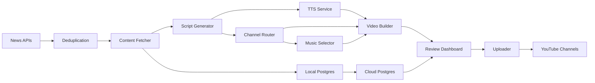

#+markdown
# AutoDrop System Architecture (Quick Reference)

## High-Level Data Flow

## Processing Stages

1. News ingestion and deduplication (URL hashing + semantic similarity).
2. Content extraction with retries and concurrency.
3. Script generation with LLM rotation to avoid quota stalls.
4. TTS generation with three-tier fallback (Kokoro, Coqui, Azure).
5. Video assembly with object-aware cropping and FFmpeg.
6. Channel routing based on category, geography, and sentiment.
7. Review and approval before upload,if needed.
8. Automated approval and upload to respective Youtube Channel.
## Storage

- Local PostgreSQL for operational data and fast queries.
- Cloud PostgreSQL for analytics and dashboard reads.
- Incremental sync from local to cloud.

## Automation

- Daily pipeline run
- Frequent news fetch
- OAuth token refresh
- Media cleanup
- Local-to-cloud database sync

## Core Metrics

- Articles processed per month
- Video generation time per item
- TTS character usage
- Upload success rate

## Technology Stack

Python, PostgreSQL, Docker, APScheduler, BeautifulSoup, Spacy, Sentence Transformers, YOLO, FFmpeg, Whisper, Gemini, Groq, Ollama, Kokoro, Coqui, Azure TTS, Flask, Streamlit.

