# AutoDrop: Technical Architecture

## Overview

AutoDrop is a multi-stage pipeline that converts news articles into short-form videos and publishes them across 6 independent channels. The system uses local GPU processing for speed and cost control, and a cloud database for analytics and monitoring.

Key characteristics:
- Multi-provider LLM rotation for quota-aware script generation
- Three-tier TTS fallback to avoid capacity bottlenecks
- GPU-accelerated video assembly with object-aware cropping
- Streamlit review workflow before upload

## System Architecture

### Logical layers

```mermaid
graph TB
    subgraph "Data Ingestion Layer"
        A["📰 News APIs<br/>Multiple sources<br/>Multi-country"]
        B["🔗 Content Fetcher<br/>BeautifulSoup<br/>Multithreaded"]
    end
    
    subgraph "Local Processing<br/>GPU-Accelerated"
        C["🧠 NLP Pipeline<br/>Spacy<br/>Sentence Transformers"]
        D["📝 Script Generator <br/> Multi-provider LLM<br/>Gemini/Groq/Ollama"]
        E["🔊 Hybrid TTS<br/>Kokoro/Coqui/Azure<br/>GPU acceleration"]
        F["🎨 Video Generator<br/>YOLO Object Detection<br/>FFmpeg Orchestration"]
    end
    
    subgraph "Knowledge Management"
        G["🗄️ Local PostgreSQL<br/>Duplicate Detection<br/>Content Deduplication"]
    end
    
    subgraph "Channel Intelligence"
        H["🎯 Channel Router<br/>Content Taxonomy<br/>Audience Mapping"]
        I["📊 Sentiment Analysis<br/>Article + Social<br/>Engagement Scoring"]
    end
    
    subgraph "Cloud Layer"
        J["☁️ Cloud PostgreSQL<br/>Metrics & Analytics<br/>Token Management"]
        K["🎬 YouTube Uploader<br/>Multi-channel Auth<br/>Metadata Generation"]
    end
    
    subgraph "Orchestration"
        L["⏱️ APScheduler<br/>IST Timezone<br/>Job Persistence"]
        M["🔄 Database Sync<br/>Generic Schema Auto-discovery<br/>Incremental Push"]
    end
    
    A --> B
    B --> C
    C --> D
    D --> E
    E --> F
    C --> G
    G --> H
    G --> I
    H --> F
    I --> F
    F --> J
    F --> K
    L -.-> A
    L -.-> D
    L -.-> F
    L -.-> K
    M -.-> G
    M -.-> J
```


### Decision Flow


## Pre-Approval Pipeline

1. News ingestion and deduplication
   - URL hashing plus semantic similarity reduces duplicates.
2. Content extraction
   - Resilient scraping with retries and concurrency.
3. Script generation
   - Multi-provider LLM rotation (Gemini, Groq, Ollama) with per-key usage tracking.
4. Audio generation
   - Tiered TTS fallback: Kokoro, Coqui, Azure.
5. Media and video generation
   - Image search rotation, object-aware cropping, FFmpeg assembly.
6. Channel routing
   - Category, geography, and sentiment drive channel assignment.
7. Review and approval
   - Streamlit UI for preview, approve/reject, and channel override.

## Post-Approval Pipeline

- Upload with per-channel OAuth tokens.
- Metadata generation tuned to each channel.
- Upload results stored for analytics.

## Data Stores

- Local PostgreSQL: operational data (articles, scripts, assets, runs).
- Cloud PostgreSQL: analytics and dashboard queries.
- Incremental sync job pushes deltas from local to cloud.

## Scheduled Jobs

- Daily pre-approval run
- Frequent news fetch
- Token refresh for all channels
- Database sync to cloud
- Media cleanup for storage hygiene

## Reliability and Cost Controls

- Provider rotation and fallback chains to avoid quota stalls.
- Local GPU processing to reduce cloud costs and latency.
- Retries with backoff for external services.
- Asset reuse to reduce bandwidth and time.

## Technical Learnings

- Quota-aware orchestration materially improves throughput.
- Semantic deduplication saves compute across the pipeline.
- Audio-visual alignment improves viewer retention.
- Hybrid local/cloud storage balances speed and observability.
      timezone: "Asia/Kolkata"
      
    - name: "Weekly Metrics Push"
      trigger: cron
      day_of_week: "mon"
      hour: 6
      minute: 0


**Job Persistence**: SQLite-backed job store survives service restarts

**Error Handling**: Failed jobs log to Telegram notifications

### Background Services

**Authentication Service** (Every 30 minutes)
- Check OAuth token expiry for each of 6 YouTube channels
- Refresh tokens with expiry < 30 minutes
- Update token_refresh_log table
- Alert if refresh fails

**Media Cleanup Service** (Daily at 2 AM)
- Delete temporary audio transcript files for successfully uploaded videos
- Delete original images (except those with 2+ reuses)
- Delete working directory files
- Update cleanup_log with freed space

**Database Synchronization Service** (Every 2 hours)
- Auto-discover database schema (all tables, columns, types)
- Query local DB for updated rows using timestamp-based detection
- Upsert rows to cloud DB with last-write-wins conflict resolution
- Update sync metadata table
- Log synced rows, duration, and errors

**Benefits**:
- Local processing: Low latency (sub-100ms queries)
- Cloud metrics: Accessible for Streamlit dashboard
- Auto-scaling: VM can shutdown after sync, cloud persists

---

## Database Schema Highlights

### Core Tables
```
news
  ├─ id (PK)
  ├─ title, description, content
  ├─ url, url_hash (UNIQUE)
  ├─ published_at, country, category
  └─ raw_json (metadata)

article_summaries
  ├─ id (PK)
  ├─ article_id (FK)
  ├─ target_channel
  ├─ hook, main_summary, call_to_action
  ├─ tts_script, visual_script
  ├─ engagement_style, target_duration
  ├─ ai_model, api_provider, generation_cost
  └─ created_at, updated_at

audio_transcripts
  ├─ id (PK)
  ├─ summary_id (FK)
  ├─ article_id (FK)
  ├─ audio_file_path
  ├─ duration, character_count
  ├─ tts_provider, tts_cost
  └─ created_at

video_generations
  ├─ id (PK)
  ├─ article_id (FK)
  ├─ visual_keywords JSONB (["stock market", "crash", ...])
  ├─ images_used JSONB ([{url, resolution, usage_count}])
  ├─ video_file_path, duration, resolution
  ├─ sentiment_score, background_music
  ├─ generation_status, generation_time_seconds
  └─ created_at

video_uploads
  ├─ id (PK)
  ├─ video_generation_id (FK)
  ├─ channel_id (FK)
  ├─ youtube_video_id
  ├─ upload_status, upload_time
  ├─ metrics (views, likes, comments)
  └─ created_at, updated_at

channels
  ├─ id (PK)
  ├─ channel_name, display_name
  ├─ target_country, category, audience_type
  ├─ oauth_token (encrypted)
  ├─ platform (YouTube)
  ├─ routing_rules JSONB
  └─ is_active
```

### Tracking & Optimization Tables
```
character_tracking
  ├─ id (PK)
  ├─ provider (Kokoro, Coqui, Azure)
  ├─ character_count, cost
  ├─ month_year
  └─ created_at

api_usage_logs
  ├─ id (PK)
  ├─ provider, api_key
  ├─ request_count, cost_usd
  ├─ quota_remaining
  ├─ date
  └─ created_at

asset_library
  ├─ id (PK)
  ├─ image_hash, image_url
  ├─ usage_count, last_used_at
  ├─ visual_keywords
  └─ created_at
```

---

## Performance Optimizations & Lessons Learned

### 1. **API Rate Limiting Mitigation**
- **Problem**: Single API provider → quota exhaustion → pipeline stops
- **Solution**: Multi-key rotation + persistent usage tracking
- **Result**: 3-5x throughput without additional cost

### 2. **Hybrid GPU Processing**
- **Problem**: Cloud video transcoding = expensive ($0.05-0.10 per video)
- **Solution**: Local GPU processing + cloud DB
- **Result**: 90% cost reduction on transcoding

### 3. **Semantic Deduplication**
- **Problem**: Similar articles processed twice → duplicate videos
- **Solution**: Cosine similarity (Spacy + Transformers)
- **Result**: 40-50% duplicate reduction

### 4. **Image Prefetching**
- **Problem**: Sequential processing → bottleneck on image download
- **Solution**: Parallel image fetch for next article while current processes
- **Result**: 30-40% faster throughput

### 5. **Asset Reuse Logic**
- **Problem**: Same news keywords → download same images repeatedly
- **Solution**: Track image usage, reuse images with 2+ uses
- **Result**: 60% reduction in bandwidth, storage savings

### 6. **TTS Provider Diversification**
- **Problem**: Azure quota limits → some articles skip audio
- **Solution**: 3-tier fallback (Kokoro → Coqui → Azure)
- **Result**: 99.9% audio generation success rate

### 7. **Incremental Database Sync**
- **Problem**: Full daily DB exports = high bandwidth
- **Solution**: Timestamp-based incremental sync every day
- **Result**: 80% reduction in sync overhead

---

## Security & Privacy Considerations

1. **API Key Management**: All keys in `.env`, encrypted in database
2. **OAuth Tokens**: Secure token storage, auto-refresh before expiry
3. **Image Copyright**: Preference for CC-licensed images, watermarking
4. **Local Processing**: News content never leaves local VM until upload
5. **Cloud DB Access**: Read-only accounts for analytics dashboard

---

## Monitoring & Alerting

**Telegram Notifications**:
- Pipeline failures (stage-by-stage errors)
- Token refresh failures
- API quota exhaustion warnings
- Unusual video generation times (>10 minutes)

**Metrics Dashboard** (Streamlit):
- Real-time pipeline status
- Module success/failure rates
- API cost tracking
- Video performance analytics

---

## Future Enhancements

1. **ML-Based Thumbnail Generation**: Predict best frame for thumbnail
2. **Engagement Predictions**: ML model to predict view counts pre-upload
3. **Multi-Platform Expansion**: Instagram, TikTok, Snapchat
4. **Dynamic Pricing**: Optimize LLM provider selection by cost/quality
5. **Cross-Channel Engagement**: Currently disabled (high API quota) but fully implemented

---

## Deployment & Operations

**Production Environment**:
- Local VM (Debian) with GPU (RTX 3060)
- PostgreSQL 15 (local for fast processing)
- Cloud PostgreSQL 15 (metrics, backups)
- Docker containerization for easy deployment
- Systemd services for scheduler background execution

**Development Environment**:
- Same stack with smaller GPU or CPU-only mode
- Pytest test suite (95+ tests)
- Mock APIs for testing without rate limits

---

## Summary: Why This Architecture Works

| Aspect | Approach | Why It Works |
|--------|----------|------------|
| **Speed** | Local GPU + cloud DB | Sub-second local queries, minimal network overhead |
| **Cost** | Multi-provider APIs | Free tier stacking prevents quota exhaustion |
| **Reliability** | 3-tier TTS + multi-key LLM | Single provider failure != pipeline failure |
| **Quality** | Semantic deduplication + sentiment analysis | Higher engagement, fewer duplicate videos |
| **Scale** | Image prefetch + parallel workers | Linear throughput increase with worker count |
| **Automation** | APScheduler + background services | Hands-off operation, minimal manual intervention |
| **Observability** | Detailed logging + Telegram alerts | Quick problem detection and resolution |
